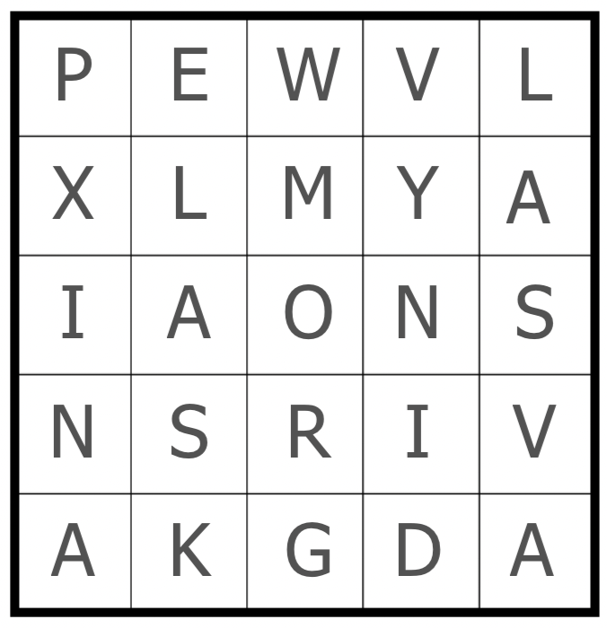

# Jane Street Puzzle: Numbers 4
This is my solution to get on the leaderboard for Jane Street's Puzzle [Altered States 2](https://www.janestreet.com/puzzles/altered-states-2-index/)


```
AWARDS:  (20S)(NOCAL)(PA)
SCORE:  168725432
STATES:  {'OH', 'IA', 'TX', 'ME', 'ID', 'KS', 'AK', 'NV', 'FL', 'NY', 'MT', 'IN', 'AL', 'AZ', 'GA', 'IL', 'AR', 'VA', 'LA', 'PA'}
```

## Usage
```
# Make sure you have pypy3 installed
./runner.sh
```

## Details
See blog post: https://www.kevinfox.dev/
